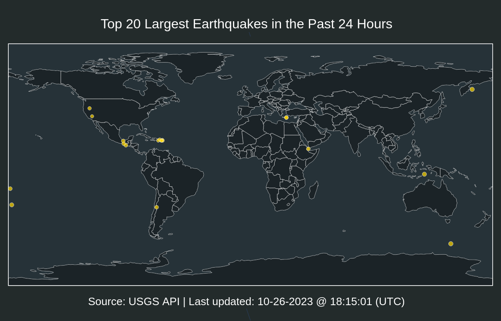

# Top 20 Largest Earthquakes in the Past 24 Hours

| Location | Mag | Date and Time (UTC) |
|:---|:---|:---|
| [60 km SW of Pelabuhanratu, Indonesia](https://earthquake.usgs.gov/earthquakes/eventpage/us6000m1ar) | 5.3 | 01-03-2024 00:53:47 |
| [12 km N of Anamizu, Japan](https://earthquake.usgs.gov/earthquakes/eventpage/us6000m1bj) | 5.3 | 01-03-2024 01:54:34 |
| [34 km SSE of Madang, Papua New Guinea](https://earthquake.usgs.gov/earthquakes/eventpage/us6000m1bg) | 5.2 | 01-03-2024 01:43:15 |
| [25 km E of Hinatuan, Philippines](https://earthquake.usgs.gov/earthquakes/eventpage/us6000m1b7) | 5.2 | 01-03-2024 01:11:30 |
| [central Mid-Atlantic Ridge](https://earthquake.usgs.gov/earthquakes/eventpage/us6000m18t) | 5 | 01-02-2024 19:33:26 |
| [95 km NNW of San Antonio de los Cobres, Argentina](https://earthquake.usgs.gov/earthquakes/eventpage/us6000m1ae) | 5 | 01-02-2024 22:57:01 |
| [31 km WSW of Darapidap, Philippines](https://earthquake.usgs.gov/earthquakes/eventpage/us6000m18z) | 5 | 01-02-2024 19:59:31 |
| [70 km NE of Anamizu, Japan](https://earthquake.usgs.gov/earthquakes/eventpage/us6000m1bt) | 4.9 | 01-03-2024 03:54:13 |
| [19 km SW of Anamizu, Japan](https://earthquake.usgs.gov/earthquakes/eventpage/us6000m13q) | 4.9 | 01-02-2024 08:13:41 |
| [49 km WNW of San Antonio de los Cobres, Argentina](https://earthquake.usgs.gov/earthquakes/eventpage/us6000m16b) | 4.8 | 01-02-2024 14:33:33 |
| [44 km WNW of Tarama, Japan](https://earthquake.usgs.gov/earthquakes/eventpage/us6000m13z) | 4.8 | 01-02-2024 09:20:22 |
| [43 km ENE of Anamizu, Japan](https://earthquake.usgs.gov/earthquakes/eventpage/us6000m17v) | 4.8 | 01-02-2024 17:21:47 |
| [11 km SW of Anamizu, Japan](https://earthquake.usgs.gov/earthquakes/eventpage/us6000m13h) | 4.8 | 01-02-2024 06:57:54 |
| [47 km NE of Anamizu, Japan](https://earthquake.usgs.gov/earthquakes/eventpage/us6000m182) | 4.6 | 01-02-2024 17:30:31 |
| [25 km N of Ifrane, Morocco](https://earthquake.usgs.gov/earthquakes/eventpage/us6000m13n) | 4.6 | 01-02-2024 07:37:51 |
| [201 km NW of Gorontalo, Indonesia](https://earthquake.usgs.gov/earthquakes/eventpage/us6000m1bm) | 4.6 | 01-03-2024 02:47:16 |
| [7 km WSW of Anamizu, Japan](https://earthquake.usgs.gov/earthquakes/eventpage/us6000m1a4) | 4.4 | 01-02-2024 21:32:38 |
| [20 km W of Ambrolauri, Georgia](https://earthquake.usgs.gov/earthquakes/eventpage/us6000m13r) | 4.4 | 01-02-2024 08:44:47 |
| [10 km S of Ashkāsham, Afghanistan](https://earthquake.usgs.gov/earthquakes/eventpage/us6000m18n) | 4.3 | 01-02-2024 19:26:00 |
| [69 km S of Gambell, Alaska](https://earthquake.usgs.gov/earthquakes/eventpage/us6000m18j) | 3.7 | 01-02-2024 18:51:50 |
