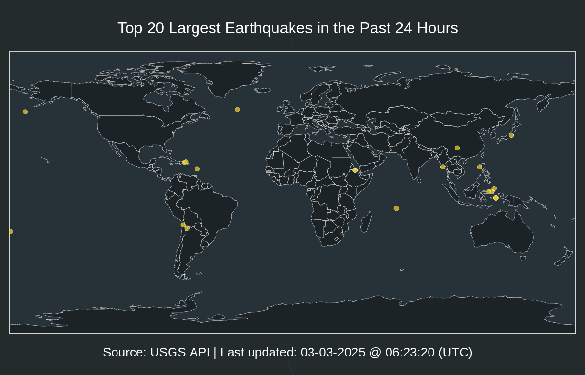

# Top 20 Largest Earthquakes in the Past 24 Hours

| Location | Mag | Date and Time (UTC) |
|:---|:---|:---|
| [26 km WNW of Ollagüe, Chile](https://earthquake.usgs.gov/earthquakes/eventpage/us6000m3kd) | 5.2 | 01-14-2024 01:08:13 |
| [4 km W of Fonte Bastardo, Portugal](https://earthquake.usgs.gov/earthquakes/eventpage/us6000m3la) | 4.9 | 01-14-2024 08:19:55 |
| [Izu Islands, Japan region](https://earthquake.usgs.gov/earthquakes/eventpage/us6000m3in) | 4.8 | 01-13-2024 15:10:59 |
| [Fiji region](https://earthquake.usgs.gov/earthquakes/eventpage/us6000m3kc) | 4.8 | 01-14-2024 00:50:24 |
| [7 km W of Yacuiba, Bolivia](https://earthquake.usgs.gov/earthquakes/eventpage/us6000m3le) | 4.7 | 01-14-2024 09:54:10 |
| [177 km W of Labuha, Indonesia](https://earthquake.usgs.gov/earthquakes/eventpage/us6000m3k7) | 4.6 | 01-14-2024 00:10:20 |
| [20 km WSW of Tocopilla, Chile](https://earthquake.usgs.gov/earthquakes/eventpage/us6000m3iy) | 4.4 | 01-13-2024 16:55:54 |
| [1 km SSW of Peqin, Albania](https://earthquake.usgs.gov/earthquakes/eventpage/us6000m3k3) | 4.4 | 01-13-2024 23:17:53 |
| [159 km ESE of Terney, Russia](https://earthquake.usgs.gov/earthquakes/eventpage/us6000m3jp) | 4.2 | 01-13-2024 20:57:03 |
| [30 km SW of Ashkāsham, Afghanistan](https://earthquake.usgs.gov/earthquakes/eventpage/us6000m3ir) | 4.1 | 01-13-2024 15:55:46 |
| [10 km NE of Pāhala, Hawaii](https://earthquake.usgs.gov/earthquakes/eventpage/hv73715842) | 2.91 | 01-13-2024 15:12:58 |
| [61 km NE of Chalkyitsik, Alaska](https://earthquake.usgs.gov/earthquakes/eventpage/us6000m3jv) | 2.7 | 01-13-2024 21:32:59 |
| [6 km ENE of Edmond, Oklahoma](https://earthquake.usgs.gov/earthquakes/eventpage/ok2024awxp) | 2.67 | 01-13-2024 12:55:03 |
| [8 km SSW of Indios, Puerto Rico](https://earthquake.usgs.gov/earthquakes/eventpage/pr71436843) | 2.64 | 01-14-2024 04:58:53 |
| [8 km SW of Volcano, Hawaii](https://earthquake.usgs.gov/earthquakes/eventpage/hv73715997) | 2.63000011 | 01-13-2024 18:52:26 |
| [62 km SSW of Cantwell, Alaska](https://earthquake.usgs.gov/earthquakes/eventpage/ak024n5qfug) | 2.6 | 01-14-2024 00:35:37 |
| [5 km SSW of Pāhala, Hawaii](https://earthquake.usgs.gov/earthquakes/eventpage/hv73715872) | 2.51999998 | 01-13-2024 16:14:56 |
| [47 km WNW of Happy Valley, Alaska](https://earthquake.usgs.gov/earthquakes/eventpage/ak024n9r2oy) | 2.5 | 01-14-2024 07:10:17 |
| [6 km WSW of Volcano, Hawaii](https://earthquake.usgs.gov/earthquakes/eventpage/hv73716452) | 2.49000001 | 01-14-2024 05:25:46 |
| [5 km SSW of Idyllwild, CA](https://earthquake.usgs.gov/earthquakes/eventpage/ci40459511) | 2.48 | 01-14-2024 02:10:57 |
